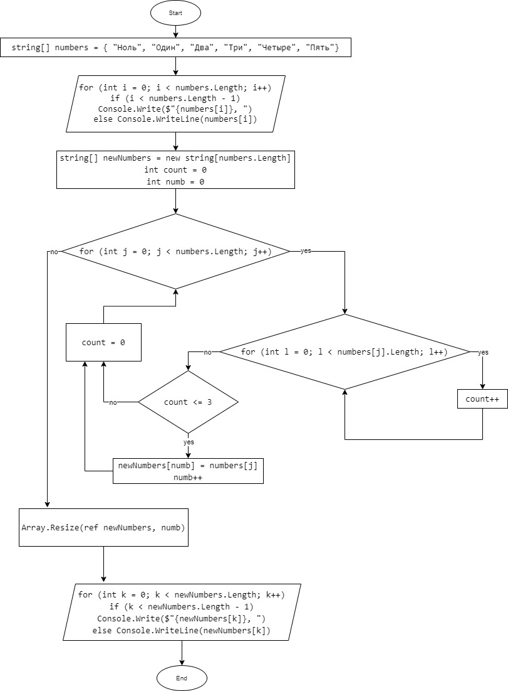

# Итоговая проверочная работа

## 1. Введение в задачу
Для задачи за основу был взят массив с цветами радуги. Т.К. наша задача сделать массив меньше того что был, а за основу мы берем массив с количеством цветов радуги, получается наш новый массив должен получиться меньше семи `7` строк.

Первым действием мы предоставляем пользователю данную информацию
```
string[] color = { "Красный", "Оранжевый", "Желтый", "Зеленый", "Голубой", "Синий", "Фиолетовый" };

Console.WriteLine("Вам предоставлено семь цветов: ");

for (int i = 0; i < color.Length; i++)
{
    if (i < color.Length - 1)
        Console.Write($"{i + 1}. {color[i]}, ");
    else
        Console.WriteLine($"{i + 1}. {color[i]}");
}
```

## 2. Подготовка к решению
Т.К. у каждого пользователя свой любимый цвет, да еще их может быть и несколько, мы спрашиваем у пользователя сколько цветов из предложенных ему нравится.
Благодаря полученной информации от пользователя мы уже или создаем новый массив или получаем информацию о том что данному пользователю ни один из данных цветов не нравиться. `Например пользователю больше нравиться чёрный или белый цвет`
```
Console.WriteLine("Введите числом сколько цветов из представленных вам нравятся: ");
count = Console.ReadLine();
if (string.IsNullOrEmpty(count))
{
    Console.WriteLine("Вам не нравятся ни один из предоставленных цветов :( ");
    return;
}
int numb;
numb = Convert.ToInt32(count);
if (numb == 0)
        Console.WriteLine("Вам не нравятся ни один из предоставленных цветов :( ");
else
{
    while (numb <= 0 || numb > 7)
    {
        Console.WriteLine("Введено число не соответствующее количеству предоставленных цветов." );
        Console.WriteLine("Введите числом сколько цветов из представленных вам нравятся: ");
        numb = Convert.ToInt32(Console.ReadLine());
    }
```
Если не один цвет пользователю не нравится то на этом этапе мы и заканчиваем работу с пользователем.
Если же пользователю нравиться хотя бы один `1` цвет, то мы идем дальше.

## 3. Создание нового массива
После того как мы узнали количество цветов которые нравятся пользователю мы создаем новый массив исходя из полученных данных.
```
string[] userColor = new string[numb];
```
А далее просим указать какие цвета нравятся пользователю
```
for (int j = 0; j < userColor.Length; j++)
    {
        like = Convert.ToInt32(Console.ReadLine());
        while (like <= 0 || like > 7)
        {
            Console.WriteLine("Введено число не соответствующее предоставленному цвету. Укажите числа соответствующие данным цветам: ");
            like = Convert.ToInt32(Console.ReadLine());
        }
        userColor[j] = color[like - 1];
    }
```


## 4. Вывод данных
Ну и последним этапом выводим пользователю список нового массива с цветами которые он выбрал
```
Console.WriteLine("Выбранные вами цвета: ");
    for (int k = 0; k < userColor.Length; k++)
    {
        if (k < userColor.Length - 1)
            Console.Write($"{userColor[k]}, ");
        else
            Console.WriteLine(userColor[k]);
    }
```
## 5. Нюансы и заключения
К сожалению из-за простоты работы но полным понимание поэтапности определенных выводов не получилось сделать данную работу методами. Также в самой программе осталось пару пробелов из-за которых может программа выдать ошибку, но данные моменты были сведены к минимуму.

## 6. Блок схема


